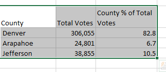
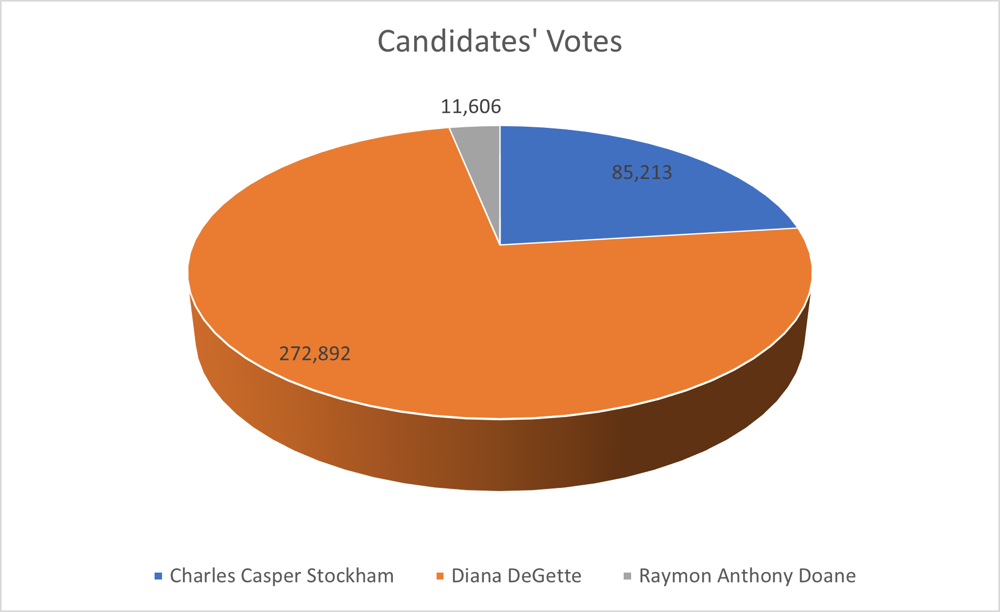

# Election-Analysis

## Overview of Election Audit
The results of the election was audited to present a clear analysis of votes, percentages, and winner determination both for candidates and counties that participated in the election; this will enable stakeholders to proceed to the next stage in the process of forming the relevant government.

## Election-Audit Results
A total of 369,711 votes were cast in the congressional elections. County breakdown of votes is as follows:
Denver: 306,055 or 82.8% of toal votes
Jefferson: 38,855 or 10.5% of total votes
Arapahoe: 24,801 or 6.7% of total votes
Clearly, the county with highest voter turnout is Denver.
 

The votes received by candidates are the following:
Diana DeGette: 272,892 votes or 73.8% of total votes cast
Charles Casper Stockham: 85,213 or 23.0% of total votes cast
Raymon Anthony Doane: 11,606 or 3.1% of total votes cast
The clear winner in this case was Diana DeGette with 272,892 votes or 73.8% of total votes cast.
 

## Election-Audit Summary
The script that was writen for this analysis has been shown to be both effective and efficient. It could be adapted to analyse results of most elction with minor or no modifications. For instance, to be used to analyse a city or county elections, adjustments would be made to account for wards rather than counties. It is hereby recommended that the script be adopted for analysis of future elections.